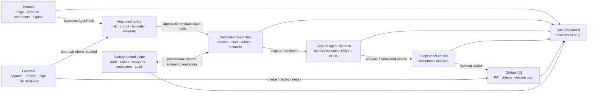

# Agent Harness integration plan

**Status:** implementation-ready architecture and packet plan

**Planning baseline:** 2026-07-23

**Owning repository:** `averray-reference-agent`

**Scope:** Hermes Ops Board integration with the generic Agent Harness and the Averray control plane

**Non-goal:** this document does not authorize dispatch, production mutation, settlement, deployment, or changes to the generic Harness kernel

> **Hermes coordinates. Harness executes. Verification gates. The operator releases.**

## 1. Executive decision

The system will keep one Hermes Ops Board and one conversational operations lead. Hermes decides
what work should be proposed and when it should be considered. A dedicated dispatcher translates
an approved, immutable `AgentTask` into the generic Harness `TaskIntent`. The Harness owns durable
technical execution. An independent verifier determines whether the output satisfies the approved
acceptance criteria. The operator retains release authority.

The integration is an adapter around the generic Harness, not a fork of it:

- Averray-, Hermes-, repository-, board-, and agent-specific policy stays outside the Harness
  kernel.
- The kernel remains domain-agnostic and continues to reject product, company, and agent names in
  its hygiene gate.
- Hermes remains the only conversational voice in the Ops Board. The Harness emits structured
  state, events, artifacts, and verification evidence; it does not narrate to the operator.
- Existing direct Codex and Claude runners remain a bounded, observable fallback during migration.
  The target executor is the Harness; model, provider, effort, and promoted-skill versions become
  run metadata rather than board lanes or sources of authority.
- The internal lane identifier remains `codex-needed` for compatibility. Its visible title becomes
  **WORK QUEUE** everywhere.

The rollout starts with versioned contracts and read-only projection. No dispatch is enabled until
the PKT-033 implementation is landed on Harness `origin/main`, the generic Harness gates are clean,
and an operator explicitly enables the supervised dispatcher.

## 2. Evidence baseline and current state

This plan is based on the fetched `origin/main` of all three repositories, not on stale local
branches or generated output.

| Repository | Inspected upstream head | Evidence relevant to this plan |
|---|---|---|
| `averray-reference-agent` | `5869af7bf2fc…` — `fix(product-health): quiet unchanged red alerts (#530)` | Hermes O0–O5, A1–A4, D1–D4, initial B/C slices, direct task queues/runners, approval policy, anomaly pause, independent review, and the current Ops Board are already implemented. |
| generic `agent-harness` | `8c0b86fd3c0…` — PKT-033 specification merge | Phases 0–5 and PKT-029–032 machinery are on main. PKT-033 is a specification only on main. The implementation and clean-gate handback exist on `origin/codex/pkt-033-real-corpus-detection` at `749e8ce…`, but are not landed. |
| Averray platform (`Polkadot`) | `38bcf834…` — worker money-rail handoff | `worker/` already maps an Averray bounty job into a Harness `TaskIntent`, executes the Harness as a black box in a deny-all-network sandbox, and assembles evidence. Claim, PR-open, submission, verification, and settlement remain platform control-plane seams. |

Primary evidence anchors:

- Hermes: `docs/HERMES_MULTI_AGENT_ORCHESTRATION_PLAN.md`,
  `docs/HERMES_ORCHESTRATION_DESIGN.md`, `docs/HERMES_INTEGRATION_MAP.md`,
  `docs/HERMES_ROADMAP.md`, `services/slack-operator/src/codex-task-queue.ts`,
  `services/slack-operator/src/monitor-v2.ts`, and the board/narration/UI types and components.
- Harness: `docs/ARCHITECTURE.md`, `docs/PHASE-6-EXIT.md`,
  `docs/packets/PKT-032-HANDBACK.md`, `docs/packets/PKT-033-real-corpus-detection.md`,
  `src/agent_runtime/contracts/task.py`, and `src/agent_runtime/contracts/run.py`.
- Averray: `docs/packets/PKT-AVGW-001-HANDBACK.md`, `worker/README.md`,
  `worker/HANDOFF.md`, `worker/src/job-adapter.js`, `worker/src/harness-driver.js`, and
  `worker/src/submission.js`.

### 2.1 Hermes capabilities to preserve, not rebuild

The current roadmap and source establish the following baseline:

The existing eight-lane pipeline remains:
`needs-attention → drafts → codex-needed → hermes-checking → operator-review → release-queue →
deploying → done`. This plan changes neither that persisted ordering nor those identifiers.

| Existing stream | Shipped capability | Integration consequence |
|---|---|---|
| O0 | Source map and integration discovery | INT-0 narrows and versions the cross-system boundary; it does not repeat discovery. |
| O1 | Agent attribution on the board | INT-1 extends attribution with structured Harness run projection. |
| O2 | Claude worker | Claude and Codex runners remain transitional fallbacks. |
| O3 | Board dispatch | INT-2 reuses the existing proposal and operator decision experience. |
| O4 | Enqueue guardrail and autonomy | INT-2 extends the fail-closed policy; it does not create a second autonomy system. |
| O5 | Liveness, retry, and restart hardening | INT-4 adds Harness/DBOS-specific drills and reconciliation. |
| A1–A4 | Scorecards, measured routing, cost, and model/effort metadata | INT-6 consumes measured evidence; it never lets a model author policy. |
| D1–D4 | Digests, decision records, anomaly pause, and alert bridge | INT-0 versions the record, INT-4 adds Harness signals, and INT-5 extends the same away mode. |
| B1–B2 | Default-off autonomous proposals and self-healing proposals | Harness work begins as proposal-only and inherits the same safety posture. |
| C1–C3 | Cross-agent review, reviewer panel, and specialists | INT-3 binds independent verification to the existing review/release flow. |

The current queue is named `CodexTask`/`codex_task`, but already accepts several agents and powers
both direct runners. The current lifecycle is `proposed → approved → running →
completed|failed|cancelled`, with one runner heartbeat projection. It is useful migration
infrastructure, but it is not a sufficient cross-system contract: it lacks a stable work item ID,
immutable TaskIntent binding, medium risk, typed capabilities, durable Harness run identity, and a
verified handoff.

### 2.2 Generic Harness capabilities and limits

The Harness already supplies the execution primitives this integration should consume:

- versioned `TaskIntent` (`harness/v1alpha1`);
- immutable `RunManifest` with task/policy/verifier hashes, grants, risk, budgets, model bindings,
  prompt versions, promoted-skill versions, and retention;
- durable DBOS workflow identity and ledger state;
- a fixed 19-event vocabulary with `run_id`, `attempt`, `correlation_id`, actor, payload/ref, and
  payload hash;
- content-addressed artifacts;
- independent verification and acceptance records;
- fail-closed capabilities, deny-by-default egress, approval/suspend/cancel/quarantine states;
- replay-safe execution and offline learning with human-gated promotion/deprecation.

The generic CLI can inspect a known run (`status`, `events`, `deliverables`, approvals, artifacts),
but it does not currently expose a global run-list API. That is not a blocker:

- INT-1 registers a small set of known pilot run bindings for read-only projection.
- INT-2 persists the `workItemId ↔ harnessRunId` binding as part of dispatch, so later discovery
  does not require scanning internal DBOS tables.
- The board adapter must not query private DBOS tables or infer state from process liveness.

Phase-6 deterministic machinery is complete, but the upstream exit record still states that
empirical real-model closure is pending. Phase 7 is an architectural direction in the Harness,
not an implementation packet. Therefore this plan does not claim either phase complete.

### 2.3 Existing Averray worker seam

The platform `worker/` is an Averray demand-side profile and adapter. It must not be copied into the
reference agent or generalized into the kernel. It already proves several correct boundaries:

- an Averray job is translated into a generic `TaskIntent`;
- the Harness is invoked as a black box;
- the sandbox can run with network disabled;
- an unverified run cannot be presented as verified;
- the work engine does not receive settlement authority;
- claim, authenticated PR open, submission, verification, and settlement remain downstream
  platform operations.

The Hermes dispatcher is a separate operations integration seam. It may submit approved technical
work to the same generic Harness, but Averray economic jobs continue to use the platform worker and
control plane. Both paths correlate through stable IDs; neither path absorbs the other's authority.

## 3. Target organization and hard boundaries



### 3.1 Role definitions

- **Operator:** the accountable release owner and approval authority for high-risk or irreversible
  actions. Humans merge, deploy, grant new authority, promote/deprecate learned skills, and
  authorize settlement policy.
- **Hermes:** the operations lead. Hermes observes, triages, proposes, sequences, explains, and
  records decisions. Hermes decides what and when within versioned policy; it does not choose
  unrestricted implementation commands.
- **Dispatcher:** a narrow non-conversational control component. It validates the exact approved
  task and policy hashes, maps to `TaskIntent`, submits once, records the run binding, reconciles
  events, and refuses authority expansion.
- **Harness:** the technical executor. It decides how to perform the bounded task through its
  strategy, tools, models, and approved promoted skills. It owns durable execution truth.
- **Verifier:** an execution-independent judge that evaluates the immutable approved acceptance
  criteria and produces a signed/hashed acceptance decision and evidence references.
- **Averray control plane:** owner of identities, authorization, claims, sessions, economic job
  state, submission eligibility, settlement, and the economic audit trail.
- **GitHub/CI:** owner of repository mutation truth after a branch or PR exists, including commits,
  checks, reviews, merge, release, and deploy status.
- **Ops Board:** a correlated projection of the above systems. It can initiate an operator command
  through an authoritative API; it never becomes the execution or economic ledger.

For an Averray-backed job, control-plane authorization is mandatory and authoritative; a local
dispatch policy can only narrow it. For a repository-only Hermes task with no Averray job, the
authority source is the operator-approved, versioned dispatch policy. Neither Hermes nor the
Harness can mint either form of permission.

### 3.2 RACI and authority matrix

`A` = accountable/authoritative, `R` = performs, `C` = consulted/input, `I` = informed/projected,
`—` = no authority.

| Action | Operator | Hermes | Dispatcher | Harness | Verifier | Averray control plane | GitHub/CI |
|---|---:|---:|---:|---:|---:|---:|---:|
| Observe and triage | A | R | I | I | I | I | I |
| Propose technical work | A | R | C | — | C | C | C |
| Classify risk under versioned rules | A | R | R | — | C | C | — |
| Approve low-risk auto-eligible dispatch | A via policy | R under policy | R/enforce | — | — | — | — |
| Approve medium-risk dispatch | A | R/propose | R/enforce | — | C | C | — |
| Approve high-risk or irreversible work | A/R | C | R/enforce | — | C | C | — |
| Compile and bind `TaskIntent` | I | C | A/R | C/schema | C | C | — |
| Execute bounded technical work | I | I | C/control | A/R | I | — | — |
| Change run grants/budget/deadline | A | C/propose | R/enforce | — | C | C | — |
| Judge acceptance | I | I | C | — | A/R | I | C/evidence |
| Open an ordinary PR | A via policy | C | R where delegated | — | C/gate | C when economic | A/state |
| Merge or release | A/R | C | — | — | C | C | A/state |
| Deploy production | A/R | C | — | — | C | C | A/state |
| Claim/submit/settle an Averray job | A via policy | C | C/request only | — | C | A/R | C |
| Promote/deprecate a Harness skill | A/R | C | — | — | C | — | C |
| Propose a Phase-7 Harness change | A | C | — | R/produce evidence only | R/independent evidence | — | C |
| Merge a Phase-7 Harness change | A/R | C | — | — | C | — | A/state |

### 3.3 Explicitly forbidden authority

The Harness and its models must never receive:

- wallets, private keys, seed phrases, JWT signing keys, settlement credentials, or economic
  signing authority;
- production secrets or unrestricted production access;
- claim, submission, or settlement authority;
- policy-authoring or policy-approval authority;
- unrestricted deployment capability;
- the ability to impersonate a human approval;
- final review, merge, or release authority;
- authority to broaden their own grants, budget, deadline, network access, allowed paths, or child
  delegation;
- authority to promote, activate beyond approved grants, silently restore, or merge their own
  learned skill changes.

Verifier and executor identities must be distinct for the same run. A direct runner cannot approve
its own proposal, and a Harness execution result cannot mark itself verified.

No single agent may request, execute, finally approve, and financially settle the same action.
Every protected action records one requester, one executor, one independent verifier where
technical work is involved, and one authority owner. The operator owns the global HALT; Hermes may
trigger an anomaly pause only under versioned policy; the dispatcher enforces both; the Harness
may only suspend/cancel within the resulting bounded control instruction.

## 4. Sources of truth and reconciliation

| Fact | Authoritative source | Board behavior |
|---|---|---|
| Proposed work and its current approval | Versioned `AgentTask` store plus append-only approval records | Project exact version/hash and actor; never infer approval from lane placement. |
| Risk, grants, allowlists, budgets, and autonomy | Versioned policy artifact and operator approval log | Show policy version/hash and the effective decision. |
| TaskIntent submitted to the Harness | Content-addressed TaskIntent artifact plus dispatch binding | Show ref/hash; no editable prompt after approval. |
| Run state, attempts, events, and terminal outcome | Harness ledger/DBOS | Project state with source timestamps and stale/degraded markers. |
| Run artifacts and verification evidence | Harness artifact store and verifier record | Link immutable refs/hashes; never copy mutable summaries as proof. |
| Averray identity, claim, session, submission, verification, and settlement | Averray control plane | Show economic state and IDs; never derive it from a PR or Harness completion. |
| Branch, commit, PR, checks, review, merge, release, and deploy | GitHub/CI/release system | Existing GitHub projection remains authoritative. |
| Board lane, title, “working now,” and digest | Ops Board read model | Explicitly non-authoritative, reproducible from the sources above. |
| Model/provider/effort and active skill versions | Immutable Harness `RunManifest`/events | Display as metadata and evidence, not executor ownership or policy. |

Every source adapter returns `observedAt`, source `updatedAt`, and
`healthy|stale|degraded|unavailable`. An unavailable source produces an honest degraded card. It
must not preserve a green state indefinitely or synthesize completion.

### 4.1 Stable identities

The following identifiers are carried unchanged wherever applicable:

- `correlationId`: one end-to-end trace across proposal, decision, dispatch, run, verification,
  PR, and economic operations;
- `workItemId`: stable Hermes work identity across task versions and projection type changes;
- `harnessRunId`: immutable Harness run/workflow identity;
- `averrayJobId` and `averraySessionId`: present only when the work is an Averray economic job;
- GitHub `{repository, pullRequestNumber}` and immutable head SHA when a PR exists;
- `taskVersion`, `taskHash`, `taskIntentRef`, `taskIntentHash`, `policyVersion`,
  `policyHash`, `runManifestRef`, and `runManifestHash`.

Idempotency keys are scoped to the action, for example
`dispatch:{workItemId}:{taskVersion}:{taskHash}` and
`handoff:{harnessRunId}:{verificationDecisionHash}`. Retries return the existing binding/result;
they do not create a second run or PR.

## 5. Versioned integration contracts

Contracts live in `@avg/schemas`, use strict validation, preserve unknown-version refusal, and are
serialized canonically before hashing. JSON examples below are illustrative; the implementation
packet must publish Zod schemas, inferred TypeScript types, fixtures, and compatibility tests.

Shared integration primitives are also versioned and strict:

```ts
type Sha256 = `sha256:${string}`;
type IsoDateTime = string; // Zod datetime with offset

type ActorRef = {
  type: "operator" | "hermes" | "policy" | "dispatcher" |
    "harness" | "verifier" | "averray" | "github";
  id: string;
};

type ArtifactRef = {
  uri: string;
  sha256: Sha256;
  mediaType?: string;
  sizeBytes?: number;
};

type CapabilityGrant = {
  capabilityId: string;
  resource: string;
  constraints: Record<string, string | number | boolean | string[]>;
  expiresAt?: IsoDateTime;
};

type AcceptanceCriterion =
  | { id: string; type: "command"; command: string; workingDirectory?: string; required: boolean }
  | { id: string; type: "search"; include: string[]; pattern: string;
      expectedMatches: number; required: boolean }
  | { id: string; type: "baseline_comparison"; rule: "no_new_failures";
      baselineCommand?: string; required: boolean }
  | { id: string; type: "rubric"; rubric: string; threshold: number;
      judgedDeliverables: string[]; borderlineMargin: number; required: boolean };

type ModelBindingMetadata = {
  role: string;
  adapter: string;
  provider: string;
  modelRef: string;
  profileHash: string;
  judgeIndependence?: string;
};

type MutationRef = {
  system: "agent-task" | "agent-harness" | "github" | "averray" | "policy";
  action: string;
  target: string;
  idempotencyKey?: string;
  resultRef?: ArtifactRef;
};

type HarnessRunState =
  | "accepted" | "contract_compiled" | "environment_preparing" | "environment_ready"
  | "strategy_selected" | "executing" | "verifying" | "repairing" | "replanning"
  | "approval_required" | "suspended" | "finalizing" | "completed" | "partial"
  | "failed" | "cancel_requested" | "compensating" | "cancelled" | "quarantined"
  | "learning_queued" | "learning_processed";
```

IDs are non-empty, bounded strings in their owning namespace. USD authorization uses integer
microdollars; the schema must not use binary floating point for authorization. Artifact hashes are
mandatory for evidence and approval bindings. Free-form `constraints` are display/audit data only;
the dispatcher maps only policy-recognized capability schemas and refuses unknown keys.

### 5.1 `AgentTask` v1

`AgentTask` is the immutable-after-approval coordination contract. It is not a shell prompt and not
an authorization by itself.

```ts
type AgentTaskV1 = {
  schemaVersion: 1;
  kind: "agent_task";
  workItemId: string;
  taskVersion: number;
  correlationId: string;
  taskKind: string;
  lifecycle: "proposed" | "approved" | "dispatching" | "running" |
    "verifying" | "handoff_ready" | "blocked" | "failed" | "cancelled";
  proposal: {
    title: string;
    objective: string;
    whyNow: string;
    requestedBy: ActorRef;
    createdAt: string;
    sourceRefs: ArtifactRef[];
  };
  repository: {
    provider: "github";
    nameWithOwner: string;
    baseRevision: string;
    allowedPaths: string[];
    forbiddenPaths: string[];
  };
  intent: {
    apiVersion: "harness/v1alpha1";
    profile: string;
    templateRef: ArtifactRef;
    templateHash: string;
  };
  acceptance: {
    criteria: AcceptanceCriterion[];
    verifierPlanRef: ArtifactRef;
    verifierPlanHash: string;
  };
  risk: {
    tier: "low" | "medium" | "high";
    reasons: string[];
    irreversible: boolean;
  };
  requestedAuthority: {
    grants: CapabilityGrant[];
    network: "deny" | { allowlist: string[] };
    maxChildren: number;
    maxConcurrentChildren: number;
    delegable: false;
  };
  budget: {
    elapsedSeconds: number;
    modelTokens: number;
    toolCalls: number;
    estimatedUsdMicros: number | null;
  };
  deadline: string;
  executor:
    | { kind: "harness"; selectionReason: string }
    | { kind: "direct";
        directAgent: "codex" | "claude" | "test-writer" | "security" | "docs";
        selectionReason: string };
  approval: {
    required: "policy" | "operator";
    status: "pending" | "approved" | "denied" | "expired";
    actor?: ActorRef;
    decidedAt?: string;
    policyVersion: string;
    policyHash: string;
    approvedTaskHash?: string;
  };
  timestamps: {
    proposedAt: string;
    approvedAt?: string;
    dispatchClaimedAt?: string;
    runBoundAt?: string;
    terminalAt?: string;
    updatedAt: string;
  };
  bindings?: {
    harnessRunId?: string;
    runManifestRef?: ArtifactRef;
    runManifestHash?: string;
    averrayJobId?: string;
    averraySessionId?: string;
    pullRequest?: { repository: string; number: number; headSha: string };
  };
};
```

Invariants:

- `workItemId` is stable and `taskVersion` increases for material changes.
- Objective, repository scope, TaskIntent template, acceptance, risk, requested authority, budget,
  deadline, executor kind, and policy hash are immutable after approval.
- Any material edit invalidates approval and creates a new version; the old version remains
  auditable.
- Approved effective grants are equal to or narrower than requested grants.
- `delegable` is always `false` in the initial integration.
- `executor.kind="direct"` is a compatibility mode, not the target design.
- A Harness binding is written once. A second, conflicting `harnessRunId` is a quarantine event.

### 5.2 `AgentRunProjection` v1

`AgentRunProjection` is a read-only, lossy board projection. It can never be used to resume,
approve, cancel, release, or settle a run without an authoritative command path.

```ts
type AgentRunProjectionV1 = {
  schemaVersion: 1;
  kind: "agent_run_projection";
  workItemId: string;
  correlationId: string;
  harnessRunId: string;
  taskVersion: number;
  source: {
    system: "agent-harness";
    health: "healthy" | "stale" | "degraded" | "unavailable";
    observedAt: string;
    sourceUpdatedAt?: string;
    reason?: string;
  };
  heartbeat: {
    status: "active" | "stale" | "terminal" | "unknown";
    lastEventAt?: string;
    ageSeconds?: number;
  };
  run: {
    state: HarnessRunState;
    attempt: number;
    terminal: boolean;
    outcome?: "completed" | "partial" | "failed" | "cancelled";
    reason?: string;
    lastEventAt?: string;
  };
  manifest: {
    ref?: ArtifactRef;
    hash: string;
    profile: string;
    riskClass: string;
    effectiveCapabilities: string[];
    network: "deny" | { allowlist: string[] };
    policyHash: string;
    verifierHash: string;
    modelBindings: ModelBindingMetadata[];
    skillVersions: string[];
  };
  progress: {
    phase: string;
    summary: string;
    completedUnits?: number;
    totalUnits?: number;
    blocker?: string;
  };
  budget: {
    elapsedSecondsUsed?: number;
    modelTokensUsed?: number;
    toolCallsUsed?: number;
    estimatedUsdMicrosUsed?: number;
    exhausted: boolean;
  };
  artifacts: ArtifactRef[];
  verification?: {
    status: "pending" | "passed" | "failed" | "inconclusive";
    decisionRef?: ArtifactRef;
    decisionHash?: string;
  };
  bindings?: AgentTaskV1["bindings"];
};
```

The summary is deterministic structured rendering from Harness state/events. It is not free-form
model narration. Raw prompts, secrets, credentials, unredacted logs, and model chain-of-thought
must never enter the projection.

### 5.3 `VerifiedHandoff` v1

`VerifiedHandoff` is the only Harness-to-review handoff eligible to advance toward PR/release.

```ts
type VerifiedHandoffV1 = {
  schemaVersion: 1;
  kind: "verified_handoff";
  workItemId: string;
  correlationId: string;
  harnessRunId: string;
  taskVersion: number;
  taskHash: string;
  taskIntentRef: ArtifactRef;
  taskIntentHash: string;
  runManifestRef: ArtifactRef;
  runManifestHash: string;
  outcome: "completed" | "partial" | "failed";
  deliverables: {
    patchRef?: ArtifactRef;
    commitSha?: string;
    summaryRef: ArtifactRef;
    structuredSubmissionRef: ArtifactRef;
    artifacts: ArtifactRef[];
  };
  checks: Array<{
    name: string;
    commandHash?: string;
    status: "passed" | "failed" | "skipped";
    evidenceRef: ArtifactRef;
  }>;
  verification: {
    verified: boolean;
    decision: "accept" | "reject" | "inconclusive";
    verifier: ActorRef;
    planHash: string;
    decisionRef: ArtifactRef;
    decisionHash: string;
    evidenceRefs: ArtifactRef[];
    verifiedAt: string;
  };
  openQuestions: string[];
  eligibleForPrOpen: boolean;
  pullRequest?: { repository: string; number: number; headSha: string };
  generatedAt: string;
};
```

`eligibleForPrOpen` can be true only when outcome is `completed`, verification is `accept`, every
required check passed, refs/hashes match the approved task and run manifest, and policy permits the
PR-open action. A handoff never grants merge or deployment authority.

### 5.4 `HermesDecisionRecord` v2

The current v1 decision record remains readable. V2 adds explicit fields required for an
explainable cross-system decision instead of hiding them in generic input/outcome maps.

```ts
type HermesDecisionRecordV2 = {
  schemaVersion: 2;
  kind: "hermes_decision";
  decisionId: string;
  correlationId: string;
  workItemId?: string;
  decisionType:
    | "task_proposal"
    | "risk_classification"
    | "executor_selection"
    | "dispatch_approval"
    | "dispatch_refusal"
    | "anomaly_pause"
    | "handoff"
    | "escalation"
    | "away_digest";
  proposal: {
    what: string;
    why: string[];
    whyNow?: string;
    evidenceRefs: ArtifactRef[];
  };
  inputs: Array<{
    name: string;
    ref?: ArtifactRef;
    hash?: string;
    observedAt?: string;
  }>;
  routing?: {
    executor: "harness" | "direct";
    modelProvider?: string;
    modelRef?: string;
    reason: string;
    scorecardRef?: ArtifactRef;
  };
  risk: {
    tier: "low" | "medium" | "high";
    reasons: string[];
    irreversible: boolean;
  };
  approval: {
    required: "policy" | "operator";
    decision: "pending" | "approved" | "denied" | "expired" | "not_applicable";
    actor?: ActorRef;
    policyVersion: string;
    policyHash: string;
    decidedAt?: string;
  };
  effects: {
    mutates: boolean;
    mutations: MutationRef[];
    authorityChanged: boolean;
    budgetChanged: boolean;
  };
  next: {
    action: string;
    owner: "operator" | "hermes" | "dispatcher" | "harness" | "verifier" | "averray";
    dueAt?: string;
    blockedBy?: string[];
  };
  generatedAt: string;
};
```

Compatibility rules:

- V1 records are decoded by a V1 schema and mapped to an in-memory compatibility view.
- Existing V1 files are not rewritten.
- New Harness-related decisions are written only as V2 after INT-0.
- Unknown versions fail visibly and are projected as a source/contract error.

## 6. One-board lifecycle

The board keeps one correlated work item. It must not show separate task, run, and PR cards for the
same `workItemId`; the projection enriches or changes the card presentation as authoritative
bindings appear.

| Authoritative state | Board presentation | Operator action |
|---|---|---|
| `AgentTask.proposed` | `codex-needed` / **WORK QUEUE**, proposal and risk visible | Approve, edit as a new version, or deny |
| Approved, no run binding | **WORK QUEUE**, “dispatch pending” | Wait or cancel through authoritative task API |
| Dispatcher validation refused | Needs attention, exact policy/hash refusal | Revise as a new task version or cancel |
| Harness `accepted|compiled|environment_ready|strategy_selected|executing|repairing|replanning` | **WORK QUEUE**, live structured progress and last-event time | Observe; cancel only through control API |
| Harness `approval_required|suspended` | Needs attention/decision inbox | Required actor approves or denies through control API |
| Harness `verifying|finalizing` | Verification/checking presentation | Observe verifier evidence |
| Harness `partial|failed|cancelled|quarantined` or verification reject | Needs attention, failure and retry eligibility | Review; retry creates a new attempt/run under policy |
| Verified handoff, no PR yet | **WORK QUEUE**, “verified handoff ready” | Open PR if policy/operator permits |
| PR open | Existing GitHub/CI lanes, same `workItemId` | Review checks and evidence |
| CI/review failed | Existing needs-attention lane | Fix via a new bounded task/attempt |
| CI green, release pending | Existing operator-review/release presentation | Human merge/release |
| Merged/deployed | Done/recently shipped | Observe; reconcile economic state separately |

An Averray job may be technically complete while economic submission or settlement is pending.
The card must show both axes rather than collapse them into a single “done” boolean:

- `technicalState`: Harness/verifier/GitHub;
- `economicState`: Averray control plane;
- `releaseState`: operator/GitHub/deploy system.

### 6.1 Board naming and agent presentation

- Preserve internal lane ID `codex-needed` in routes, filters, snapshots, saved layout, API shapes,
  and migration tests.
- Change every visible lane/KPI title to **WORK QUEUE** (sentence case is acceptable only where the
  UI style transforms labels).
- Add `harness` as an execution source/agent tag, not as a new lane.
- Display provider/model/effort beneath a Harness run as metadata.
- Keep Hermes as the sole natural-language voice. Harness progress uses fixed labels such as
  “executing · attempt 2 · last event 28s ago,” not an invented agent chat message.

## 7. Dedicated dispatch path

The dispatcher accepts typed IDs and artifacts, never an unrestricted shell string:

1. Hermes creates an `AgentTask` proposal and a V2 decision record explaining what, why, why now,
   risk, requested authority, budget, executor, and next owner.
2. Contract validation canonicalizes and hashes the task.
3. Versioned risk, allowlist, budget, concurrency, repository, path, network, autonomy, and HALT
   checks run fail-closed.
4. The required approval actor approves that exact task version and hash.
5. The dispatcher atomically claims the task using the dispatch idempotency key.
6. It maps the approved fields into a generic `TaskIntent` and proves the mapped authority is a
   subset of the approved authority.
7. It persists the content-addressed TaskIntent ref/hash and submits it through the generic
   Harness control interface.
8. It records the returned `harnessRunId` and manifest binding exactly once using an outbox.
9. The Harness performs durable execution. Structured events and artifacts are projected
   read-only to the board.
10. An independent verifier evaluates the original acceptance plan and creates a
    `VerifiedHandoff`.
11. A policy-gated PR opener or the operator creates the PR using the verified handoff. The
    executor cannot open an unverified PR or merge it.
12. GitHub/CI, the operator, and—when applicable—the Averray control plane continue their
    authoritative review, release, submission, and settlement flows.

Any hash mismatch, unknown contract version, policy version change after approval, expanded grant,
expired deadline, exhausted budget, stale approval, duplicate conflicting binding, unavailable
authoritative source, or global HALT causes refusal or suspension. None is converted into a
best-effort prompt.

## 8. Risk and autonomy policy

Risk is three-tiered in the integration contract even though the legacy queue currently exposes
only high/low.

| Tier | Examples | Initial dispatch rule | PR/release rule |
|---|---|---|---|
| Low | Documentation, tests, static analysis, non-sensitive internal tooling, small isolated UI work, narrow deterministic source edits, and strictly verified dependency maintenance with no lifecycle scripts or security/infra/auth/economic change; deny-all network and reversible branch-only output | Supervised in INT-2; eligible for policy approval only after burn-in in INT-5 | Verified PR may be opened under policy; human still merges/releases |
| Medium | Backend behavior, API/schema changes, CI workflows, larger dependency/config updates, data-processing logic, bounded network allowlists, and material cost | Explicit operator approval; max concurrency 1; tighter budget and deadline | Operator PR-open/review; human merge/release |
| High | Contracts/chain behavior, wallets/signing/settlement/claims, authentication/authorization, secrets, database migrations, production infrastructure, deployment systems, policy/permission changes, Harness self-evolution, or any irreversible action | Never auto-dispatch; many categories are categorically forbidden to Harness, otherwise require explicit operator plan and separate capabilities | Human-only review, merge, deployment, and economic authorization |

Initial invariants:

- `HARNESS_DISPATCH_ENABLED=false` until INT-2 acceptance.
- Global and repository HALT override all autonomy and retry paths.
- Harness concurrency is one; child delegation is disabled.
- Network is deny by default. An allowlist is explicit, task-scoped, expiring, and approved.
- Budgets apply before submission and during execution. Exhaustion suspends/fails closed.
- Retry never expands scope, grants, budget, deadline, or risk tier. Material changes require a new
  task version and approval.
- Away mode does not broaden authority. It may only exercise actions already allowed by the active
  policy version.
- Learned routing and model scores can recommend within the allowlist; hard policy, risk, budget,
  approval, and HALT rules always win.

### 8.1 Autonomy levels

| Level | Meaning | Allowed behavior |
|---|---|---|
| A0 — observe | INT-1 default | Read and project known Harness runs; no mutation. |
| A1 — supervised | INT-2 through burn-in | Hermes proposes; an operator approves every dispatch; dispatcher executes the exact approved task. |
| A2 — policy-bounded away | INT-5 only | Hermes may approve and dispatch explicitly allowlisted low-risk work inside start/expiry, task, concurrency, token, and spend limits. |
| A3 — measured routing | INT-6 only | Routing may change inside A2 authority from versioned measured evidence; no new action or grant becomes autonomous. |

There is no unrestricted autonomy level. Medium/high risk, new authority, skill
promotion/deprecation, merge, deployment, economic settlement, and Harness self-evolution always
retain their explicit human or control-plane gates.

## 9. Migration and compatibility

The migration is additive and reversible:

1. Add the four versioned contracts and compatibility decoders.
2. Add read-only Harness projection behind `HARNESS_PROJECTION_ENABLED=false`.
3. Rename only visible `codex-needed` copy to **WORK QUEUE**; keep identifiers and API paths stable.
4. Project two manually created real Harness pilot runs—one successful, one failed—through known
   bindings. Do not add dispatch.
5. Add the supervised dispatcher as an alternate executor behind a separate flag. Keep direct
   runners enabled as fallback.
6. For newly approved eligible work, select `executor.kind="harness"`; retain
   `executor.kind="direct"` for explicit fallback and unsupported profiles.
7. Migrate queue storage through dual-read/single-write:
   - read legacy `codex_task` V1 and map it to the compatibility view;
   - write new proposals as `agent_task` V1 after INT-2;
   - do not rewrite historical records;
   - preserve current `POST /monitor/codex-tasks` as a compatibility route until clients move to
     an `agent-tasks` endpoint;
   - preserve existing dedupe behavior for legacy items, but use `workItemId` plus task hash for
     new idempotency.
8. Remove direct runners only after the burn-in criteria below are met and a separate removal
   packet is approved.

Fallback is a deliberate executor selection with a V2 decision record. The dispatcher must not
silently fall back after a Harness failure because that could run the same task twice.

### 9.1 Burn-in exit before direct-runner retirement

- at least 20 eligible low-risk Harness work items across at least three task families;
- at least 14 consecutive days without an uncontained authority or duplicate-dispatch incident;
- 100% correlation from task through run and handoff, and through PR when present;
- zero unverified PR openings;
- successful completion of all INT-4 failure drills;
- measured completion, verification, cost, and latency no worse than the approved thresholds;
- explicit operator decision to retire each fallback independently.

## 10. Integration packets

Each packet is a narrow PR with its own handback, clean diff, smallest relevant tests, source
impact statement, rollback, and any environment changes. INT packet numbers are local to this
integration and do not redefine Hermes O/A/B/C/D/T streams or Harness Phase numbers.

### INT-0 — charter and versioned contracts

**Goal:** land this charter and the four strict schemas without runtime behavior.

**Deliverables:**

- `AgentTask` V1, `AgentRunProjection` V1, `VerifiedHandoff` V1, and
  `HermesDecisionRecord` V2 in `@avg/schemas`;
- canonical serialization/hashing helpers and fixtures;
- V1 decision-record and legacy `codex_task` compatibility readers;
- source-of-truth, identity, RACI, and risk invariants pinned in tests/docs;
- no new dispatch route and no policy allowlist expansion.

**Gate:** schema tests prove round trip, unknown-version refusal, approval invalidation on material
change, grant attenuation, verified-handoff eligibility, and V1 read compatibility. Every
protected action has an unambiguous requester, executor, verifier, and authority owner; no role can
both execute and finally approve the same work.

### INT-1 — read-only Harness projection

**Goal:** display real successful and failed Harness runs in the existing board without enabling
task submission or any Harness mutation.

**Deliverables:**

- a narrow read port that permits only known-run `status`, `events`, and `deliverables` reads;
- an allowlisted pilot binding registry containing no secrets;
- pure mapping into `AgentRunProjection`;
- honest source health, staleness, terminal failure, verification, artifacts, and correlation;
- one correlated card per work item;
- visible **WORK QUEUE** title while preserving `codex-needed`;
- Harness tag and structured progress, with Hermes still the only conversational voice.

**Feature flag:** `HARNESS_PROJECTION_ENABLED=false` by default. The flag controls only reads and
rendering. No `HARNESS_DISPATCH_ENABLED` code path exists in this packet.

**Acceptance proof:**

- one real successful and one real failed Harness run are projected by immutable run ID, with a
  quarantined-state fixture in the mapper tests;
- killing or denying the read source changes the card to stale/degraded, never healthy;
- no test or source in the packet calls `run submit`, `approve`, `deny`, `cancel`, `release`, skill
  mutation, wallet, GitHub write, or Averray mutation commands;
- the same run event sequence always yields the same projection;
- unknown state/version fails visibly;
- legacy task/PR cards and saved lane identifiers remain compatible.

**Exact proposed files:**

| File | Change |
|---|---|
| `services/slack-operator/src/harness-run-registry.ts` | New strict loader for allowlisted pilot `{workItemId, correlationId, harnessRunId}` bindings and staleness settings. |
| `services/slack-operator/src/harness-read-port.ts` | New interface plus safe read-only CLI adapter; fixed argv, timeout, output limits, redaction, and no shell interpolation. |
| `services/slack-operator/src/harness-run-projection.ts` | New pure state/event/manifest-to-`AgentRunProjection` mapper and source-health calculation. |
| `services/slack-operator/src/monitor-v2.ts` | Merge correlated Harness projections into the existing board snapshot without duplicate cards. |
| `services/slack-operator/src/monitor-hermes-board.ts` | Add structured execution facts to the slim board input. |
| `services/slack-operator/src/monitor-hermes-narration.ts` | Replace Codex-owned lane language with work-queue language and fixed Harness progress phrasing. |
| `services/slack-operator/src/monitor-hermes-voice.ts` | Carry the bounded projection fields while preserving one Hermes voice. |
| `services/slack-operator/src/index.ts` | Load the read-only source behind the projection flag and pass results into board construction. |
| `packages/monitor-ui/src/lib/monitor/card-types.ts` | Add `harness` agent/source and the V1 projection fields to the UI boundary. |
| `packages/monitor-ui/src/lib/monitor/board-columns.ts` | Change visible title/subtitle to **WORK QUEUE**; preserve ID. |
| `packages/monitor-ui/src/components/Board.tsx` | Change the legacy visible lane label only. |
| `packages/monitor-ui/src/components/TopStrip.tsx` | Change visible KPI label only. |
| `packages/monitor-ui/src/components/ui.tsx` | Add a Harness tag tone/label. |
| `packages/monitor-ui/src/components/cards/Card.tsx` | Render structured run state, attempt, source age, and verification badge. |
| `packages/monitor-ui/src/components/drawer/DrawerBody.tsx` | Render manifest/grants/model/skill/artifact/failure details without raw secret-bearing logs. |
| `packages/monitor-ui/src/components/hermes/CoPilotRail.tsx` | Replace visible Codex queue copy where it describes the shared lane; no create/dispatch changes. |
| `packages/monitor-ui/src/styles/monitor.css` | Add only the presentation styles required for the new metadata/health states. |
| `test/unit/harness-run-registry.test.ts` | Binding validation, duplicates, unknown version, and no-secret fixtures. |
| `test/unit/harness-read-port.test.ts` | Fixed read-only argv, timeout/output/redaction, malformed output, and forbidden-command pins. |
| `test/unit/harness-run-projection.test.ts` | State mapping, correlation, determinism, staleness, failed/quarantined runs, and unknown-state refusal. |
| `test/unit/monitor-v2.test.ts` | Correlated merge/no-duplicate and source-failure coverage. |
| `test/unit/monitor-hermes-board.test.ts` | Slim board projection coverage. |
| `test/unit/monitor-hermes-narration.test.ts` | One-voice and work-queue copy coverage. |
| `packages/monitor-ui/src/lib/monitor/board-columns.test.ts` | Visible-title/internal-ID compatibility pin. |
| `packages/monitor-ui/src/components/Board.test.tsx` | Legacy board title compatibility. |
| `packages/monitor-ui/src/components/TopStrip.test.tsx` | KPI copy coverage. |
| `packages/monitor-ui/src/components/cards/Card.test.tsx` | Successful, running, stale, failed, and verified rendering. |
| `packages/monitor-ui/src/components/drawer/DrawerBody.variant.test.tsx` | Harness detail and redaction coverage. |

If INT-0 lands separately, INT-1 imports `AgentRunProjection` from `@avg/schemas`. It must not
create a second UI-only authoritative schema; current duplicated monitor/UI types should be
adapted at the HTTP boundary and retired in a later cleanup packet.

### INT-2 — supervised dispatch

**Goal:** submit approved low/medium-risk tasks through a dedicated dispatcher with concurrency
one.

**Dependencies:**

- PKT-033 implementation and handback merged to Harness `origin/main`;
- clean offline and PostgreSQL Harness gates from the landed commit;
- pinned compatible Harness contract/CLI version;
- INT-0/INT-1 accepted, including outage behavior;
- operator-approved policy version, repositories, profiles, capabilities, budgets, and pilot
  users;
- global HALT and rollback tested.

**Deliverables:** dispatch claim/idempotency, approved-task-to-TaskIntent mapping, attenuation
proof, outbox-backed run binding, supervised operator decision, cancellation/timeout control,
direct-runner explicit fallback, and audit records. Start with low-risk tasks; medium risk requires
an operator approval. High risk remains forbidden or human-only.

**Gate:** concurrent/replayed dispatch creates exactly one Harness run; approval/hash/policy/grant
mismatches refuse; HALT wins; no wallet/settlement/deploy/GitHub-merge capability is present.
Several representative low-risk tasks complete through the supervised path; failed verification
produces no submission; restart and duplicate delivery remain idempotent.

### INT-3 — verified PR handoff

**Goal:** connect the independent Harness verifier to the existing C1/C2 review and GitHub/CI flow.

**Deliverables:** verified-handoff store/validation, PR-open eligibility check, evidence links,
head-SHA binding, existing reviewer-panel integration, and reconciliation after GitHub changes.

**Gate:** false/inconclusive/mismatched/stale verification cannot open a PR; a valid handoff can
open at most one PR; executor cannot review, merge, or deploy; human release remains explicit.

### INT-4 — hardening and failure drills

**Goal:** extend O5 and D3/D4 to the Harness/DBOS boundary.

**Deliverables:** source-age alerts, reconciliation worker, poison-event quarantine, orphan
detectors, duplicate-binding detector, durable leases, bounded retry eligibility, queue
backpressure, an external watchdog, alerts that do not depend on Hermes availability, operator
runbook, dashboards, and all drills in section 11.

**Gate:** every drill has deterministic detection, containment, recovery, audit evidence, and an
owner; no recovery silently expands authority or duplicates execution.

### INT-5 — away mode after burn-in

**Goal:** allow the existing away mode to approve only proven low-risk Harness tasks.

**Dependencies:** INT-4 accepted, minimum burn-in evidence achieved, operator-approved policy
version, and alert bridge verified.

**Deliverables:** explicit start and expiry, low-risk repo/task-family allowlists, maximum
spend/tokens/tasks/concurrency, concurrency one initially, per-repo/daily budgets, quiet-hour rules,
immediate anomaly pause, high-risk escalation, one-command HALT, verified-result-only draft PR
creation, bounded idempotent retries, and away digest. Medium/high risk and policy changes remain
operator-only.

**Gate:** policy-denied, stale, anomalous, or budget-exhausted tasks remain proposed; returning
operator receives a complete decision/run/handoff digest. Across 10–20 or more representative
supervised tasks there are zero unauthorized actions, zero duplicate submissions, every high-risk
task is escalated, and all recovery drills are green.

### INT-6 — measured routing

**Goal:** use A1–A3 evidence to choose eligible profile, model/provider/effort, and direct fallback
within hard policy.

**Deliverables:** scorecard inputs, cost/latency/success/safety thresholds, shadow recommendation,
bounded rollout, conservative defaults for unknown task families, and decision-record
explanations. The executor is still the Harness; model and provider are run metadata.

**Gate:** a recommendation cannot bypass risk, grants, approval, HALT, budget, verifier
independence, or an operator override. Shadow results must show an approved improvement before
activation.

### INT-7 — Phase-7 evolution

**Goal:** allow evidence-backed `harness_evolution` cards to propose improvements to the generic
Harness only after the Harness publishes detailed Phase-7 packets.

**Required proposal contents:** failure evidence, causal mechanism, affected profiles, eval suite,
baseline/experiment, one changed variable, cost/latency/safety results, rollout, rollback, and
human reviewers.

**Gate:** no self-modifying runtime path, no self-merge, no hygiene exception, no product-specific
kernel code, no permission expansion, and explicit operator approval. A plan paragraph in the
architecture is not a sufficient packet.

## 11. Failure drills

INT-4 must run these against disposable or isolated environments and record detection time,
containment, recovery, data reconciliation, and authority checks.

| Drill | Injected failure | Required outcome |
|---|---|---|
| Dispatcher crash before submit | Claim persisted, no Harness call | Lease expires/reconciles; retry submits once using same idempotency key. |
| Dispatcher crash after submit before binding write | Harness has run, task appears dispatching | Reconcile by correlation/idempotency; bind existing run, never submit a second. |
| Duplicate webhook/event | Same event delivered repeatedly/out of order | Projection is idempotent and monotonic by event identity/attempt; no duplicate card/action. |
| Harness/DBOS unavailable | Status reads and controls fail | Card becomes degraded/stale; dispatch pauses; existing green state is not extended. |
| Harness worker killed mid-run | Worker stops after a durable step | DBOS state remains recoverable; external watchdog alerts; restart resumes/reconciles without a duplicate protected effect. |
| Board unavailable | UI/read model down | Harness execution continues durably; recovery replays projections without control mutations. |
| Policy changes after approval | Active policy hash differs | Pre-submit refusal; already-running manifest remains immutable and is flagged for operator review. |
| Approval/task hash mismatch | Edited task reuses old approval | Refuse and require a new task version/approval. |
| Capability expansion | Mapper or skill requests more authority | Fail closed before execution; immutable refusal evidence. |
| Budget/deadline exhaustion | Run exceeds approved boundary | Harness suspends/fails according to policy; no automatic budget/deadline increase. |
| Global HALT during run | Operator sets HALT | New dispatch stops; in-scope runs receive bounded cancel/suspend; audit records result. |
| Verifier outage | Execution completes, judge unavailable | Technical output remains unverified; no PR-open eligibility. |
| Verification timeout | Verifier exceeds the approved deadline | Handoff remains ineligible, timeout is visible, and bounded retry/escalation follows policy. |
| Verifier rejects output | Completed run fails acceptance | Needs attention; executor cannot override or relabel acceptance. |
| Malicious/oversized event | Secret-like or huge payload | Adapter redacts/truncates/quarantines; board remains available and source shows degraded. |
| Conflicting run binding | Same task version points at two run IDs | Quarantine work item, stop downstream actions, require operator reconciliation. |
| PR head changes after handoff | PR SHA differs from verified SHA | Verification becomes stale; block release until re-verification. |
| PR API failure | Verified handoff cannot open or read a PR | Retain the handoff and idempotency key, show the outage, and retry without opening duplicate PRs. |
| Averray control-plane outage | Economic state unavailable | Keep technical state but show economic state unknown; do not claim, submit, or settle. |
| Settlement replay | Same eligible handoff submitted twice | Averray idempotency returns existing result; no duplicate economic mutation. |
| Direct fallback after Harness failure | Operator selects fallback | Require explicit new decision/idempotency scope; prove the old run is terminal/cancelled first. |
| Hermes unavailable | Conversational coordinator stops | Dispatcher admits no unapproved work, external alerts remain active, durable runs follow policy, and the board exposes coordinator unavailability. |

## 12. Observability and audit requirements

Minimum structured dimensions:

- all stable IDs from section 4.1;
- task, TaskIntent, manifest, policy, verifier plan, and decision hashes;
- task risk, effective capabilities, network mode, budget remaining, and deadline;
- dispatch decision/refusal reason and idempotency result;
- Harness state, attempt, last event time, source age, outcome, model/provider/effort, and skill
  versions;
- verification status and evidence refs;
- PR number/head SHA/check/review/release state;
- Averray job/session/submission/settlement IDs and states, with no credentials;
- actor type and identity for every approval or mutation;
- redaction/truncation/quarantine counters;
- projection lag and reconciliation lag.

Logs and board payloads must not contain TaskIntent secrets, environment values, private prompts,
raw credentials, wallet material, or chain-of-thought. Artifact access follows the owning system's
authorization and retention policy.

## 13. Decisions and rationale

1. **One board, one voice.** Multiple executor lanes or model personas would make implementation
   choices appear to be operational authorities. Structured projection keeps Hermes accountable
   for coordination while preserving execution evidence.
2. **Keep `codex-needed`, rename its presentation.** The ID is embedded in routing, snapshots,
   filters, tests, and saved state. A visible rename achieves the operating model without a risky
   storage/API migration.
3. **Use a dedicated dispatcher.** Replaying an unrestricted shell prompt cannot prove approval,
   idempotency, attenuation, or the exact submitted artifact. Typed mapping can.
4. **Treat the board as a projection.** Execution, economic, and repository systems already have
   stronger ledgers. Duplicating authority in a UI creates split-brain failure modes.
5. **Bind approval to content hashes.** Approval of an editable prompt is ambiguous. Exact hashes
   make material change, replay, and audit behavior deterministic.
6. **Model three risk tiers.** Medium-risk work needs more nuance than the legacy high/low flag
   while preserving a clear hard boundary for high/irreversible work.
7. **Keep direct runners during burn-in.** They are proven operational paths and provide rollback.
   Silent fallback is forbidden because it can duplicate work.
8. **Use known run bindings for INT-1.** The current generic CLI inspects a run by ID but has no
   list API. Pilot bindings prove projection without DBOS table coupling or kernel changes; INT-2
   creates future bindings durably.
9. **Do not merge the platform worker with Hermes.** It is an Averray job adapter with an explicit
   money-rail seam. Reusing its black-box principles is correct; moving economic authority into
   Hermes or Harness is not.
10. **Gate INT-2 on landed PKT-033.** A remote implementation branch with a clean-gate handback is
    useful reported evidence but not an upstream dependency. `origin/main` and clean gates from
    the landed commit are the integration pin.
11. **Separate deterministic machinery from empirical claims.** Harness Phase-6 tooling is
    implemented, but the checked upstream exit record still marks the real-model ceremony pending.
12. **Wait for detailed Phase-7 packets.** Architecture direction alone is insufficient authority
    for self-evolution. Every change remains an ordinary reviewed PR with human merge.

## 14. Open questions

No open question blocks INT-0 or the read-only INT-1 packet. The following must be resolved and
recorded before the named later gate:

1. **INT-2:** Which Harness CLI/API release and exact JSON projection schema will be pinned after
   PKT-033 lands? Prefer a published generic interface; do not couple to private DBOS tables.
2. **INT-2:** Which repositories, task profiles, capabilities, path scopes, time/token/tool/USD
   budgets, and operator identities form the first supervised allowlist?
3. **INT-2:** Should the initial dispatcher run inside `slack-operator` or as a separate service
   process sharing only the AgentTask store? Recommendation: separate process for failure and
   credential isolation, while keeping the contract/board adapters shared.
4. **INT-3:** Which service owns authenticated PR opening for non-economic Hermes tasks?
   Recommendation: a narrow GitHub write service after verified handoff, not the Harness.
5. **INT-3:** What verifier identity/provider separation is sufficient when executor and judge may
   use the same model vendor? At minimum use distinct invocation, context, credentials, and
   immutable verifier-plan hash; prefer a different model/provider for medium risk.
6. **INT-4:** What source-age and reconciliation-lag thresholds match production SLOs?
7. **INT-5:** What numeric burn-in thresholds supplement the minimums in section 9.1, and who can
   pause/re-enable away-mode Harness dispatch?
8. **INT-6:** Which scorecard window and minimum sample size are required before routing moves
   beyond shadow mode?
9. **INT-7:** What Phase-7 packet series will the generic Harness publish, and how will its
   empirical Phase-6 ceremony be independently reviewed?

## 15. First implementation handoff

The next authorized implementation should be **INT-0 only**. It should add schemas, fixtures, and
compatibility tests without changing the board, queue, runners, dispatcher, policies, or
production environment. After INT-0 review, INT-1 should be a separate read-only PR using the
exact file surface and acceptance proof in section 10.

Do not combine INT-0 and INT-1 with PKT-033, platform worker changes, supervised dispatch,
VerifiedHandoff-to-PR writes, away mode, learned routing, or Phase-7 work.
